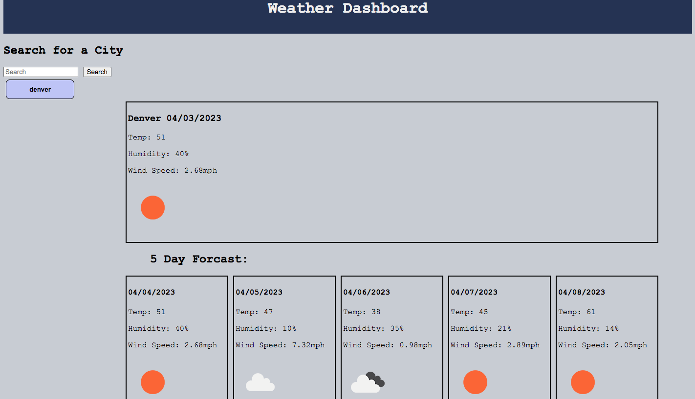

# challenge-6-weather-dashboard

## Description
In this weeks challenge I created a weather dashboard. When the dashboard is loaded it has a form input that has a title of "search for a city" and allows the user to input a city name. When the user searches for a city, they are presented with that city's current and future weather conditions. The city that the user searched for is also saved and added to the search history, and adds a button on the page with the city name that was searched. When the user inspects the weather conditions for that city, they are presented with some weather information. The weather information that the user can see is the city name, date, weather condition icon, the temperature, the humidity, and the wind speed. The user is also presented with the 5 day forcast of that searched city that displays the date, weather condition icon, temperature, humidity, and wind speed. The user is able to click on any of the previous city buttons that were saved, and they will get the current and future weather conditions again for that city.   

   

## Installation

N/A

## Usage
This weather dashboard is for everyone! It is a great way for any user to check the weather for any city they desire. This may allow the user to plan ahead up to 5 days, whether it's activities, outfits, outdoorsy plans, etc. This assignment allowed me to present a useful tool for all my users, to check current and future weather conditions for any city they choose, and plan accordingly. 

## Credits

N/A

## License

Please refer to the LICENSE in the repo